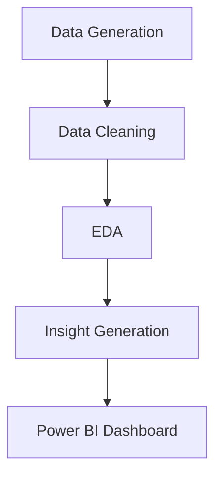

# Superstore Data Analysis & Business Intelligence Dashboard

<p align="center">
  
  
  
  
</p>

---

## 📌 About The Project

This project is a **complete end-to-end data analytics solution** built on a **synthetic Superstore dataset** to simulate real-world retail operations.

It focuses on transforming raw data into **actionable insights** using:
- 📊 Exploratory Data Analysis (EDA)
- 📈 Data Visualization
- 📉 Business Intelligence Dashboards

💡 The goal is to enable **data-driven decision-making** in areas like:
- Sales optimization  
- Customer behavior  
- Inventory management  
- Supplier efficiency  

---

## 🎯 Problem Statement

Retail businesses generate large volumes of data but often fail to utilize it effectively due to lack of structured analysis.

This results in:
- ❌ Poor visibility into performance  
- ❌ Inventory inefficiencies  
- ❌ Lack of customer insights  
- ❌ Supplier dependency risks  

👉 This project solves these challenges using **data analytics + visualization**.

---

## 🎯 Key Objectives

- Analyze **Sales, Profit & Trends**
- Understand **Customer Segmentation**
- Identify **Top Products & Regions**
- Optimize **Inventory & Supply Chain**
- Build an **Interactive Power BI Dashboard**

---

## 🧠 Key Skills Demonstrated

✔ Data Cleaning & Preprocessing  
✔ Exploratory Data Analysis (EDA)  
✔ Business Insight Generation  
✔ Dashboard Design (Power BI)  
✔ Data Storytelling  

---

## 🛠️ Tech Stack

<p>
  
</p>

**Libraries Used:**
- Pandas  
- NumPy  
- Matplotlib / Seaborn
- Faker
- Random

---

## 📊 Dashboard Highlights

### 📌 Key Metrics
- 💰 Total Sales  
- 📈 Total Profit  
- 📦 Total Quantity Sold  
- 🏷️ Average Discount  

### 📌 Analysis Covered
- Sales by Region  
- Sales by Category  
- Customer Segmentation  
- Payment Mode Analysis  
- Inventory & Reorder Tracking  

---

## 📸 Dashboard Preview
> 🎬 **Click on any dashboard below to watch the full demo video walkthrough**
<p align="center">
  <a href="https://github.com/Merdulsh2003/Superstore-Performance-Analysis/blob/master/Dashboards_Video.mp4">
    
    
    
  </a>
</p>

---

## 💡 Key Insights

- 📊 Balanced sales distribution across categories  
- 💰 Profit varies significantly by category  
- 🌍 Regional sales concentration observed  
- 💳 Digital payments dominate (UPI, Cards)  
- 📦 Inventory shows **low-stock risks**  
- 🏢 Supplier dependency detected  

---

## 🚀 Project Workflow



---
## 📈 Business Impact

- ✔ Improved understanding of sales performance  
- ✔ Identified inventory risks & reorder needs  
- ✔ Revealed customer payment behavior trends  
- ✔ Enabled data-driven decision-making  

## 🔮 Future Improvements

- 📊 Machine Learning Models (Sales Prediction)  
- 📦 Demand Forecasting  
- 🌐 Web-based Dashboard Deployment  
- ⚡ Real-time Data Integration

## 🚀 Getting Started  

```bash
git clone https://github.com/Merdulsh2003/Superstore-Performance-Analysis.git
cd Superstore-Performance-Analysis

```

## 📄 License  

This project is licensed under the **MIT License**.  

You are free to use, modify, and distribute this project with proper attribution.  
For more details, see the [LICENSE](LICENSE) file.
